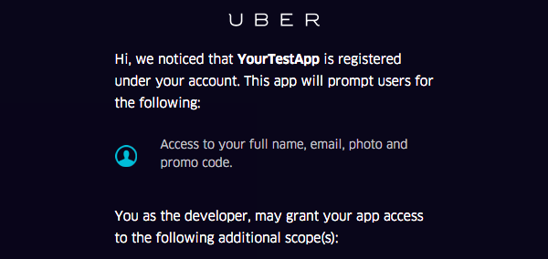
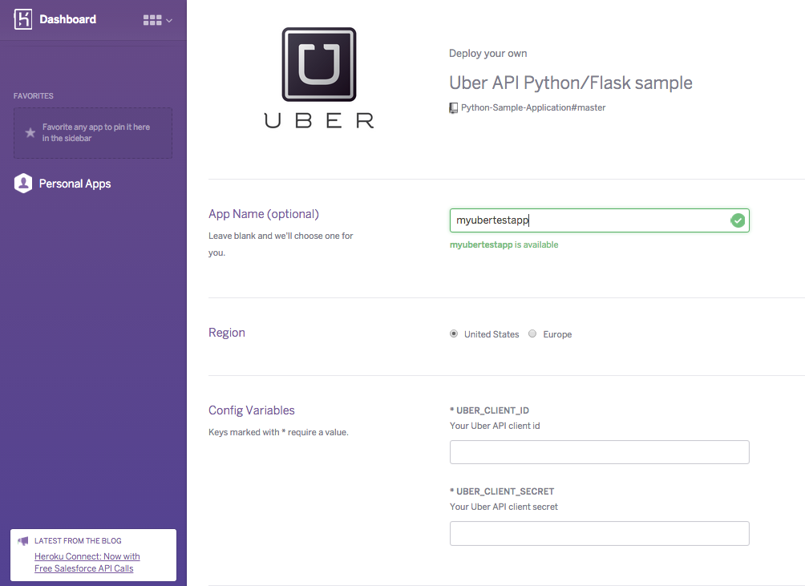

Example Python/Flask Uber App
==============================

This is an example Python/Flask application that shows a working example of [Uber's  APIs](https://developer.uber.com/), including authentication and REST calls.

This sample includes:

- [User authentication](https://developer.uber.com/v1/auth/)
- [Product query](https://developer.uber.com/v1/endpoints/)
- Time estimates
- Price estimates
- User profile & recent trip history

Full documentation of the APIs are available on the online [Uber API Documentation](https://developer.uber.com/v1/endpoints/). 

Getting started
---------------

1. Visit [https://developer.uber.com/](https://developer.uber.com/) to sign up for an Uber developer account.
2. Register a new Uber application and ensure that:
    - Your Redirect URI is `http://localhost:7000/submit` 
	- Both the `profile` and `history` OAuth scopes are checked
	- Copy your Client ID and Client Secret
3. Add your Client ID and Client Secret as local environment variables using the following:
	- `export UBER_CLIENT_ID={your client id}`
	- `export UBER_CLIENT_SECRET={your client secret}`
4. Review the `config.json` file for any relevant local changes
5. Run `pip install -r requirements.txt` to install dependencies
6. Run `python app.py`
7. Open [http://localhost:7000](http://localhost:7000) in your browser

Testing
-------

1. Install the dependencies with `make bootstrap`
2. Run the command `make test`
3. If you delete the fixtures, or decide to add some of your own, you’ll have to re-generate them, and the way this is done is by running the app, getting an auth_token from the main page of the app. Paste that token in place of the `test_auth_token` at the top of the `test_endpoints.py` file, then run the tests.

Deploying to Heroku
----------------

Click the button below to set up this sample app on Heroku:

You should see the Heroku new app screen below:.

Before your app will work, you need to:

1. Specify the Client ID and Secret in the Heroku app
2. Configure your [Uber OAuth app](https://developer.uber.com/apps/) to have a redirect URL of `https://`*{your-app-name}*`.herokuapp.com/submit` URL.
3. Configure the heroku environment variable `FLASK_DEBUG=False` to serve SSL traffic.

Making requests
---------------

The base for all requests is https://api.uber.com/v1/, where `v1` is the specific version of the API you are requestiong.

To see a list of all available endpoints, please visit: [https://developer.uber.com/v1/endpoints/](https://developer.uber.com/v1/endpoints/)

Have an for or improvement?
-----------

We’d love your pull requests and tickets on GitHub to make this sample code even better. 

1. If you open up a ticket, please make sure it describes the problem or feature request fully.
2. If you send us a pull request, make sure you add a test for what you added, and make sure the full test suite runs with `make test`.

For additional help with the Uber APIs, please see [our support page](https://developer.uber.com/support/) or check out  our [forum on StackOverflow](http://stackoverflow.com/questions/tagged/uber-api).

